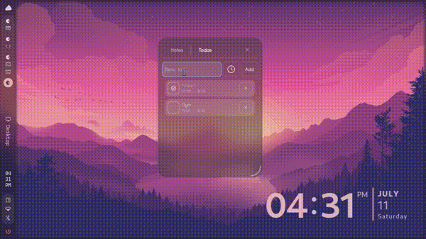
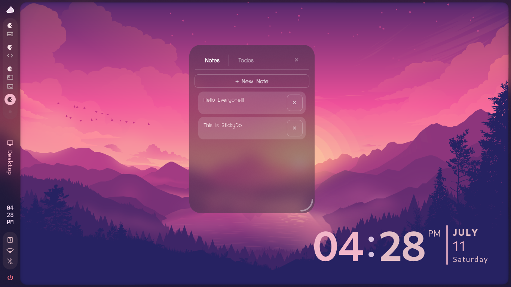
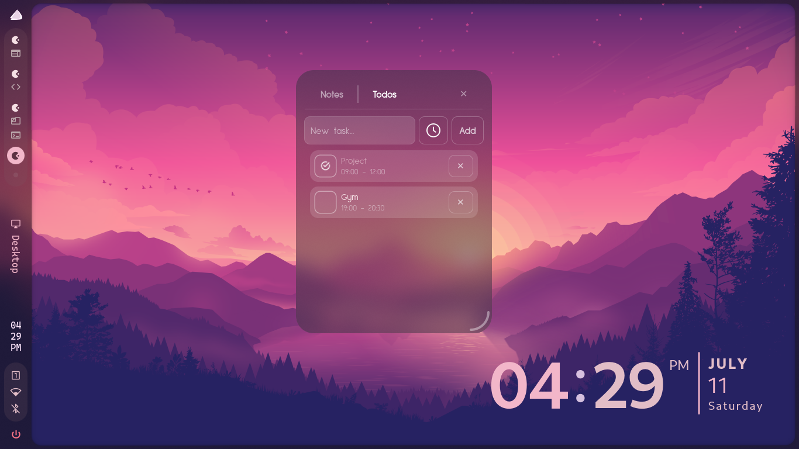

# StickyDo

A native sticky notes + to-do list panel for Wayland desktops, built with Python, GTK4, and `gtk4-layer-shell`. Instead of behaving like a normal application window, StickyDo renders as a desktop-native panel — sitting above your wallpaper and below your other windows — and is fully movable, resizable, translucent, and blurred, all implemented from scratch on top of the Wayland layer-shell protocol.






## Why

Most sticky-note apps on Linux are either X11-only or behave like ordinary floating windows. StickyDo is built specifically for the modern Wayland/Hyprland stack: it uses `wlr-layer-shell` (the same protocol behind bars and launchers like waybar and wofi) to sit natively on the desktop, with custom-built drag-to-move and drag-to-resize since layer-shell surfaces have no window manager chrome by default.

## Features

- **Notes** — create, edit, and delete freeform notes; auto-saves on every keystroke, no save button needed
- **Todos** — add tasks with optional time ranges (start/end); mark complete, delete- 
-**Single unified panel** — one movable, resizable window with a Notes/Todos tab switcher, rather than a scattered pile of separate windows
- **Desktop-native rendering** — sits above the wallpaper, below other application windows, via Wayland layer-shell
- **Custom drag-to-move and drag-to-resize** — built manually with GTK gesture controllers, since layer-shell windows have no OS-provided title bar or resize border
- **Translucent, blurred UI** — CSS-based glass theming with compositor-level background blur (Hyprland `layerrule`)
- **Custom typography and iconography** — Sulphur Point font, custom calendar/checkmark icons
- **Persistent local storage** — SQLite database at `~/.local/share/stickydo/stickydo.db`, following the XDG Base Directory spec

## Tech stack

| Layer | Technology |
|---|---|
| UI toolkit | GTK4 (via PyGObject) |
| Desktop integration | `gtk4-layer-shell` (wlr-layer-shell protocol) |
| Data persistence | SQLite (Python's built-in `sqlite3`) |
| Language | Python 3 |
| Styling | GTK CSS, generated dynamically from Python for tunable theming |
| Target compositor | Hyprland (Wayland) |

## Installation

### Dependencies

```bash
sudo pacman -S python-gobject gtk4 sqlite
yay -S gtk4-layer-shell
```

`gtk4-layer-shell` is AUR-only and requires an AUR helper (`yay`, `paru`, etc.).

### Clone and set up

```bash
git clone https://github.com/DilucAckerman/StickyDo.git
cd StickyDo
python3 -m venv venv --system-site-packages
source venv/bin/activate      # or venv/bin/activate.fish on fish shell
```

The `--system-site-packages` flag is required so the virtual environment can see the system-installed GTK bindings, which aren't available via pip.

### Run

`gtk4-layer-shell` requires being loaded before `libwayland-client` at the linker level. This is a known constraint of the library (see [gtk4-layer-shell linking notes](https://github.com/wmww/gtk4-layer-shell/blob/main/linking.md)), and is worked around at runtime with `LD_PRELOAD`:

```bash
LD_PRELOAD=/usr/lib/libgtk4-layer-shell.so.0 python3 -m stickydo.app
```

If that path doesn't exist on your system, find it with:
```bash
find / -name "libgtk4-layer-shell.so*" 2>/dev/null
```

### Optional: Background Blur

StickyDo's panel supports background blur, but blur is a *compositor-level* effect — it requires a small addition to your Hyprland config. Without this step, StickyDo still works fully and looks translucent (via its own CSS theming); it just won't have the frosted-glass blur behind it.

Add the contents of [`hyprland/stickydo-layerrules.conf`](hyprland/stickydo-layerrules.conf) to your Hyprland configuration:

- If you use a single-file setup, add the lines directly to `~/.config/hypr/hyprland.conf`
- If you use a modular/framework config that sources multiple files, add the lines to whichever file is meant for personal customizations, rather than editing framework-managed files directly

Then reload:
```bash
hyprctl reload
```

If you get a config error mentioning `invalid field`, your Hyprland version likely uses the older layer-rule syntax — see the commented alternative inside the config file itself.

## Usage

- **Notes tab** — click "+ New Note" to create one, click any note in the list to open its editor, click "← Back" to return to the list. Changes save automatically as you type.
- **Todos tab** — type a task, optionally pick a due date via the calendar icon, click "Add" (or press Enter). Click the checkbox to mark complete, click ✕ to delete. Overdue, incomplete tasks are shown in red.
- **Move the panel** — click and drag the nav bar (the area around the Notes/Todos tabs)
- **Resize the panel** — click and drag the small handle in the bottom-right corner
- **Close the panel** — click the ✕ button in the top-right of the nav bar

## Project structure

```
StickyDo/
├── hyprland/
│   └── stickydo-layerrules.conf   # optional compositor blur config
├── stickydo/
│   ├── __init__.py
│   ├── app.py                      # entry point, Gtk.Application
│   ├── db.py                       # all SQLite access (notes + todos CRUD)
│   ├── main_window.py              # panel UI: nav bar, notes view, todos view
│   ├── theme.py                    # CSS generation, tunable design constants
│   └── assets/
│       └── icons/                  # calendar.png, checkmark.png
├── stickydo.desktop
├── install.sh
└── README.md
```

The project deliberately separates concerns: `db.py` is the only file that touches SQL, `main_window.py` handles all UI structure and logic, and `theme.py` isolates all visual styling so the look of the app can be changed without touching any widget code.

## Design decisions worth noting

- **Single panel over many windows.** The project initially spawned one OS window per sticky note. It was redesigned into a single movable/resizable panel with a tab switcher, which is both a better user experience and a more advanced technical challenge, since layer-shell surfaces don't get free window-manager behavior like dragging or resizing — both are implemented manually with `Gtk.GestureDrag`, recalculating layer-shell margins and window size in real time as the user drags.
- **Generated CSS instead of a static stylesheet.** `theme.py` exposes plain Python constants (`WINDOW_OPACITY`, `TILE_OPACITY`, etc.) and builds the CSS string from them. This keeps the "note/todo tiles are always slightly more opaque than the window background" relationship enforced in code rather than duplicated by hand across two opacity values.
- **Auto-save, no save button.** Every keystroke in a note writes to SQLite immediately via a GTK buffer `"changed"` signal — consistent with how physical sticky notes work, and avoids a whole class of "did I forget to save" bugs.
- **XDG-compliant data storage.** The SQLite database lives at `~/.local/share/stickydo/stickydo.db`, following the XDG Base Directory Specification rather than dumping a file in the project folder or home directory root.

## Known constraints

- Requires Wayland + a `wlr-layer-shell`-compatible compositor (developed and tested on Hyprland). Will not work under X11.
- `LD_PRELOAD` is required at launch due to `gtk4-layer-shell`'s linking requirements — see Installation above.
- Background blur requires manual Hyprland config changes (compositor-level effect, cannot be set purely from the application).

## Roadmap

- [ ] System autostart integration (`exec-once`)
- [ ] `.desktop` file and `PKGBUILD` for proper installation
- [ ] Note color customization
- [ ] Task editing (currently delete-and-recreate only)
- [ ] Multiple panel instances / pinned notes

## License

MIT (or your preferred license — add a `LICENSE` file to match)
